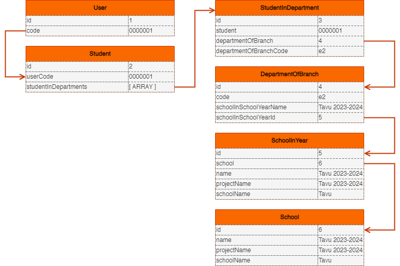

# HelloID-Conn-Prov-Target-Zermelo
| :information_source: Information |
|:---------------------------|
| This repository contains the connector and configuration code only. The implementer is responsible to acquire the connection details such as username, password, certificate, etc. You might even need to sign a contract or agreement with the supplier before implementing this connector. Please contact the client's application manager to coordinate the connector requirements.       |

| :warning: Warning |
|:---------------------------|
| Note that this connector is "a work in progress" and therefore not ready to use in your production environment. |
<br />
<p align="center">
  
</p>

## Table of contents

- [HelloID-Conn-Prov-Target-Zermelo](#helloid-conn-prov-target-zermelo)
  - [Table of contents](#table-of-contents)
  - [Introduction](#introduction)
  - [Getting started](#getting-started)
    - [Connection settings](#connection-settings)
    - [Remarks](#remarks)
      - [Underlying assumptions](#underlying-assumptions)
      - [Creating user and student accounts](#creating-user-and-student-accounts)
      - [Only the user account is managed](#only-the-user-account-is-managed)
      - [Updating account information](#updating-account-information)
      - [Dynamic calculation of school year](#dynamic-calculation-of-school-year)
      - [Setting classroom information](#setting-classroom-information)
      - [Delete user](#delete-user)
      - [Creation / correlation process](#creation--correlation-process)
  - [Getting help](#getting-help)
  - [HelloID docs](#helloid-docs)

## Introduction

_HelloID-Conn-Prov-Target-Zermelo_ is a _Target_ connector. Zermelo is an LMS and provides a set of REST API's that allow you to programmatically interact with its data. The HelloID connector uses the API endpoints listed in the table below.

|Endpoint|Description|
|------------|-----------|
|/users|Create and manage user and student accounts|
|/student|Retrieve information about student accounts|
|/departmentOfBranches|Retrieve information about the classroom and schoolyear information|
|/studentInDepartments|Manage student `departmentOfBranch` information|

## Getting started

>:exclamation: The initial release of our connector, `version 1.0.1`, is built upon several fundamental assumptions. Make sure to verify if these assumptions apply to your environment and make changes accordingly.<br>__See also:__ [Underlying assumptions](#underlying-assumptions)

### Connection settings

The following settings are required to connect to the API.

|Setting|Description|Mandatory|
|------------|-----------|-----------|
|Token|The ApiToken to authorize against the Zermelo API|Yes|
|BaseUrl|The URL of the Zermelo environment|Yes|

### Remarks

#### Underlying assumptions

Our initial `1.0.1` release of the connector is based on the following assumptions:

- The `PrimaryContract.Department.DisplayName` corresponds to the assigned classroom for the student.

>:information_source:To accurately set the classroom information for a student, additional lookup calls need to be made to retrieve the relevant details. For more information, see: [Setting classroom information](#setting-classroom-information)

- The `PrimaryContract.StartDate` represents the date when the school year is scheduled to commence.
>:information_source:In the Netherlands, this is typically on the 1st of August of the current school year.

- The `PrimaryContract.Organization.Name` corresponds to the name of school.

- Only the user account is created by HelloID, the student account will be subsequently created by setting the attribute `isStudent = true` on the user object. For more information, see: [Creating user and student accounts](#creating-user-and-student-accounts)

#### Creating user and student accounts

According to the official documentation of the Zermelo API, the procedure for creating a user account and a student account consists of two separate steps. Initially, the user account is created using the `/users` endpoint. Subsequently, the student account is created using the `/students` endpoint. However, contrary to the information provided in the official documentation, the process appears to be slightly different, and it seems that, creating a user account through the `/users` endpoint, while including the attribute `isStudent = true`, is sufficient to create a student account.

Another important point to note is that, when creating a student account through the `/student` endpoint, it is essential to only include the `userCode` attribute in the JSON payload. Any other attributes associated with the student account creation process are not permitted to be modified. Because of this, we only manage the user account from HelloID. See also: [Only the user account is managed](#only-the-user-account-is-managed)

>:information_source:For the initial `1.0.1` release of the connector, we based our implementation on the assumption that, creating a user while including the attribute `isStudent = true`, is sufficient to create a student account.

#### Only the user account is managed

In the `create` lifecycle action, we have made the assumption that we only need to handle the correlation of the user account. This is because, by creating the user account with the attribute `isStudent = true`, we are able to -simultaneously- create the student account.

>:exclamation:Attributes related to the student account can only be modified through the user account. Therefore, modifications to attributes associated with the student account should be made by updating the corresponding attributes in the user account. This means that, from the perspective of HelloID, only the user account is managed and considered the __primary entity__.

#### Updating account information

In the `Update` lifecycle action, the initial step involves retrieving the account information to be updated. This information is then compared with the corresponding data in HelloID. If there are any differences, the update will be executed.

It is important to emphasize that the retrieval and comparison are performed on the __student__ account, while the subsequent updates are targeted at the __user__ account. This behavior is intentional and not an unintended issue. For further information, please refer to: [Only the user account is managed](#only-the-user-account-is-managed)

#### Dynamic calculation of school year

The schoolYear is calculated dynamically based on the `StartDate` of the primary contract.

This means that; if a student commences on the: `1st of March 2023`, and the `PrimaryContract.StartDate` is set to the: `1st of March 2023`, the current school year should be: `2022-2023`.

>:information_source:Prior to the end of July, the ongoing school year is identified as `2022/2023`. Starting from the 1st of August, the current school year transitions to `2023/2024`

This mechanism ensures that the SchoolYear property accurately reflects the academic period during which the student accounts are created.

Translated to PowerShell, this will appear as follows:

```powershell
function Get-CurrentSchoolYear {
    [CmdletBinding()]
    param (
        [Parameter(Mandatory)]
        [DateTime]
        $StartDate
    )

    $currentDate = Get-Date
    $year = $currentDate.Year

    # Determine the start and end dates of the current school year
    if ($currentDate.Month -lt 8) {
        $startYear = $year - 1
        $endYear = $year
    } else {
        $startYear = $year
        $endYear = $year + 1
    }

    Write-Output "$startYear-$endYear"
}
```

#### Setting classroom information

We have learned that, by creating the user account with the attribute `isStudent = true`, we are able to -simultaneously- create the student account. See also: [Creating user and student accounts](#creating-user-and-student-accounts)

Subsequently, a student account must be assigned a `studentInDepartments` entity, which contains information about the classroom and, by extension, the school year. This assignment can only be achieved by performing a lookup and matching equivalent data.

The following data is available to us in HelloID:

|Name|Description|Where to find in Zermelo|Value|
|------------|-----------|-----------|-----------|
|Person.ExternalId|Student number|__/Student__<br>userCode|<br>0000001|
|PrimaryContract.Department.DisplayName|Classroom|__/StudentInDepartment__<br> departmentOfBranchCode|<br>e2|
|PrimaryContract.StartDate|School year|__/DepartmentOfBranch__<br>schoolInSchoolYearName|<br>Tavu 2023-2024|
|PrimaryContract.Organization.Name|School name|__/SchoolInYear__<br> schoolName|<br>Tavu|

To assign the `studentInDepartment` entity, the following data is required:

|Attribute|Description|
|------------|-----------|
|student|The unique identifier of the student|
|departmentOfBranch|The unique identifier of a `DepartmentOfBranch` entity|

To obtain the `departmentOfBranch` information, it is necessary to perform a lookup in the `departmentOfBranch` endpoint. The matching criteria involve making the following comparisons:

- `departmentOfBranchCode` with the `PrimaryContract.Department.DisplayName`
- `schoolInSchoolYearName` with the `PrimaryContract.StartDate` and `PrimaryContract.Organization.Name`

Translated to PowerShell, this will appear as follows:

```powershell
function Get-DepartmentToAssignFromPrimaryContract {
    [CmdletBinding()]
    param (
        [Parameter(Mandatory)]
        [string]
        $SchoolName,

        [Parameter(Mandatory)]
        [string]
        $DepartmentName,

        [Parameter(Mandatory)]
        [DateTime]
        $ContractStartDate
    )

    try {
        $splatParams = @{
            Method   = 'GET'
            Endpoint = 'departmentsofbranches'
        }
        $responseDepartments = (Invoke-ZermeloRestMethod @splatParams).response.data
        [DateTime]$currentSchoolYear = Get-CurrentSchoolYear -ContractStartDate $ContractStartDate

        if ($null -ne $responseDepartments) {
            $contractStartDate = $currentSchoolYear
            $schoolNameToMatch = $SchoolName
            $schoolYearToMatch = "$($contractStartDate.Year)" +'-'+ "$($contractStartDate.AddYears(1).Year)"

            $lookup = $responseDepartments | Group-Object -AsHashTable -Property 'code'
            $departments = $lookup[$DepartmentName]
            $departmentToAssign = $departments | Where-Object {$_.schoolInSchoolYearName -match "$schoolNameToMatch $schoolYearToMatch"}
            Write-Output $departmentToAssign
        }
    } catch {
        $PSCmdlet.ThrowTerminatingError($_)
    }
}
```

This function will be called as follows: `$departmentToAssign = Get-DepartmentToAssignFromPrimaryContract -Contract $p.PrimaryContract`

For a visual representation of the relationships between the different entities, refer to the UML diagram below:



#### Delete user

Currently the `delete` lifecycle action is set to _archive_ the user account using a `PUT` method.

#### Creation / correlation process

A new functionality is the possibility to update the account in the target system during the correlation process. By default, this behavior is disabled. Meaning, the account will only be created or correlated.

You can change this behavior in the configuration by setting the checkbox `UpdatePersonOnCorrelate` to true in the configuration.

>:exclamation:Be aware that this might have unexpected implications.

## Getting help

> _For more information on how to configure a HelloID PowerShell Target connector, please refer to our [documentation](https://docs.helloid.com/hc/en-us/articles/360012558020-Configure-a-custom-PowerShell-target-system) pages_

> _If you need help, feel free to ask questions on our [forum](https://forum.helloid.com)_

## HelloID docs

The official HelloID documentation can be found at: https://docs.helloid.com/
